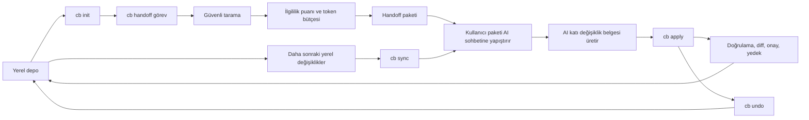

# ContextBridge Teknik Rehberi

Bu belge ContextBridge'in ne yaptığını, kararlarını nasıl verdiğini, hangi
değerleri nasıl hesapladığını ve güvenlik sınırlarını açıklar. Açıklamalar
ContextBridge `0.1.0` kaynak koduna göredir.

> Kısa ayrım: Token sayımı, SHA-256 ve sözdizimi ağacı gibi bazı parçalar
> tanımlı algoritmalara dayanır. Dosya ilgililik puanındaki `+9`, `+5`, `0.22`
> gibi katsayılar ise eğitilmiş bir modelin sonucu veya bilimsel bir olasılık
> değildir. Bunlar açıklanabilir, yerel ve deterministik ürün sezgisidir.

## İçindekiler

- [1. Amaç ve kapsam](#1-amaç-ve-kapsam)
- [2. Temel çalışma akışı](#2-temel-çalışma-akışı)
- [3. Mimari](#3-mimari)
- [4. Proje başlatma ve yerel durum](#4-proje-başlatma-ve-yerel-durum)
- [5. Depo tarama algoritması](#5-depo-tarama-algoritması)
- [6. Kod analizi ve bağımlılık grafiği](#6-kod-analizi-ve-bağımlılık-grafiği)
- [7. Token hesabı](#7-token-hesabı)
- [8. Dosya ilgililik puanı](#8-dosya-ilgililik-puanı)
- [9. Handoff paketinin oluşturulması](#9-handoff-paketinin-oluşturulması)
- [10. Snapshot ve değişiklik hesabı](#10-snapshot-ve-değişiklik-hesabı)
- [11. Sync paketi](#11-sync-paketi)
- [12. Apply güvenlik ve uygulama akışı](#12-apply-güvenlik-ve-uygulama-akışı)
- [13. Undo ve drift kontrolü](#13-undo-ve-drift-kontrolü)
- [14. Komut referansı](#14-komut-referansı)
- [15. Yapılandırma referansı](#15-yapılandırma-referansı)
- [16. Gizlilik ve güvenlik modeli](#16-gizlilik-ve-güvenlik-modeli)
- [17. Bilinen sınırlamalar](#17-bilinen-sınırlamalar)
- [18. Test ve doğrulama](#18-test-ve-doğrulama)
- [19. Araştırma ve standartlarla ilişki](#19-araştırma-ve-standartlarla-ilişki)
- [20. Sık sorulan sorular](#20-sık-sorulan-sorular)

## 1. Amaç ve kapsam

ContextBridge, yerel bir kod deposu ile web tabanlı bir AI sohbeti arasında
kontrollü bağlam taşır. Üç temel problemi çözer:

1. Bütün depoyu körlemesine göndermek yerine görevle daha ilgili dosyaları
   seçer.
2. İlk aktarımdan sonra yalnızca değişen dosyaları göndererek sohbeti güncel
   tutar.
3. AI'ın önerdiği değişiklikleri katı bir belge biçimi, path doğrulaması, diff,
   onay, yedek ve geri alma mekanizmasıyla diske uygular.

ContextBridge bir LLM değildir. Embedding üretmez, kodu bir API'ye yüklemez ve
AI yanıtının doğruluğunu ispatlamaz. Görevi; bağlam seçmek, taşımak, değişiklik
belgesini doğrulamak ve dosya işlemlerini daha güvenli hale getirmektir.

## 2. Temel çalışma akışı



Tipik kullanım:

```bash
cb init
cb handoff "Google OAuth oturum yenilemeyi tamamla"

# Üretilen paketi AI sohbetine yapıştırın.
# AI'ın ContextBridge değişiklik belgesini kopyalayın.

cb apply

# Sonraki yerel düzenlemelerden sonra:
cb sync
```

## 3. Mimari

| Katman | Sorumluluk | Ana kaynak dosyaları |
|---|---|---|
| CLI | Komutlar, seçenekler, kullanıcı onayı | `src/cli.ts` |
| Proje/config | Proje kökü, başlangıç dizinleri, config doğrulaması | `src/project.ts`, `src/config.ts` |
| Tarama | Dosya keşfi, ignore, boyut ve binary kontrolü | `src/scanner.ts` |
| Güvenlik | Secret imzaları, path ve symlink güvenliği | `src/security.ts` |
| Kod zekâsı | Sembol/import çıkarımı ve yerel graph | `src/analyzer.ts`, `src/dependencies.ts` |
| Seçim | Göreve göre açıklanabilir dosya puanlama | `src/relevance.ts` |
| Token/paket | Token sayımı, tree/map ve XML-benzeri paket | `src/tokenizer.ts`, `src/format.ts` |
| Snapshot/sync | Hash tabanlı baseline ve artımlı değişiklik | `src/state.ts`, `src/sync.ts` |
| Apply/undo | Diff, yedek, güvenli yazma ve rollback | `src/apply.ts`, `src/change-parser.ts` |
| Çıktı | Yerel dosyaya yazma ve clipboard | `src/output.ts` |

Çekirdek komutlar ağ çağrısı yapmaz. `npm install` gibi paket yöneticisi
işlemleri doğal olarak registry ağına çıkabilir; bu durum ContextBridge'in depo
tarama ve paket üretme akışından ayrıdır.

## 4. Proje başlatma ve yerel durum

### 4.1 `cb init` ne oluşturur?

Komut çalıştırıldığı dizini proje kökü kabul eder ve şu yapıyı oluşturur:

```text
.contextbridge/
├── config.json
├── state.json
├── snapshots/
├── backups/
└── outputs/
```

`.contextbridge/` girdisi kökteki `.gitignore` dosyasına eklenir. Amaç; AI'a
gönderilen paketleri, yedekleri ve yerel çalışma durumunu Git geçmişine yanlışlıkla
almamaktır.

### 4.2 Proje kökü nasıl bulunur?

Diğer komutlar mevcut dizinden yukarı doğru çıkar ve
`.contextbridge/config.json` bulunan ilk dizini proje kökü olarak kullanır.
Dosya bulunamazsa kullanıcıdan `cb init` çalıştırması istenir.

### 4.3 `state.json`

Durum dosyası şu bilgileri taşır:

```json
{
  "version": 1,
  "activeSnapshotId": null,
  "lastApplyId": null,
  "updatedAt": "2026-08-09T00:00:00.000Z"
}
```

- `activeSnapshotId`: Son başarılı handoff, sync, apply veya undo baseline'ı.
- `lastApplyId`: Geri alınabilecek son başarılı apply yedeği.
- `updatedAt`: Durumun son yazılma zamanı.

JSON durum dosyaları önce geçici dosyaya yazılır, ardından `rename` ile hedefe
taşınır. Böylece süreç yazmanın ortasında kesilirse yarım JSON bırakma riski
azaltılır.

## 5. Depo tarama algoritması

Tarama aşağıdaki sırayla yapılır. Sıra önemlidir; örneğin büyük dosya içerik
okumasından önce boyut bilgisiyle elenir.

### 5.1 Aday dosyaların bulunması

`fast-glob` ile `**/*` taranır:

- Yalnızca dosyalar alınır.
- Noktayla başlayan dosyalar aday olabilir.
- Sembolik bağlar takip edilmez.
- Sonuçlar tekilleştirilir ve path'e göre sıralanır.

Şu dizinler glob seviyesinde her zaman hariçtir:

```text
.git/
.contextbridge/
node_modules/
dist/
build/
.next/
coverage/
vendor/
```

### 5.2 Ignore kuralları

Filtre şu kaynakları birleştirir:

1. `.contextbridge/` ve `.git/`
2. `config.json` içindeki `ignore` dizisi
3. Proje kökündeki `.gitignore`
4. Proje kökündeki `.contextbridgeignore`

Pattern yorumlama `ignore` paketiyle Git tarzına yakın yapılır. Git'in resmi
belgesi pattern sırasını, `!` ile terslemeyi ve slash davranışını açıklar
([Git `gitignore` belgesi][gitignore]).

Önemli uygulama ayrıntıları:

- Glob seviyesindeki sabit dizin dışlamaları yeniden dahil edilemez.
- Secret dosya adları ignore kurallarından bağımsız güvenlik filtresinden geçer.
- Mevcut sürüm yalnızca proje kökündeki `.gitignore` dosyasını doğrudan okur;
  alt dizinlerdeki ayrı `.gitignore` dosyalarını Git'in tam hiyerarşik
  önceliğiyle değerlendirmez.

### 5.3 Secret dosya adı kontrolü

Aşağıdakiler içerikleri okunmadan elenir:

- `.env`, `.env.*`, `.npmrc`, `.pypirc`, `.netrc`
- `credentials.json`, `service-account.json`, `secrets.json` benzerleri
- `id_rsa`, `id_ed25519` ve diğer yaygın SSH anahtarları
- `.ssh/`, `.aws/`, `.gnupg/` altındaki dosyalar
- `.pem`, `.key`, `.p12`, `.pfx`, `.jks`, `.keystore`

Bu yaklaşım OWASP'ın secret'ların kaynak kodda veya düz metin config içinde
tutulmaması ve dışarı sızdırılmaması yönündeki rehberiyle uyumludur
([OWASP Secrets Management][owasp-secrets]). Ancak bu filtre bir secret vault
veya tam kapsamlı DLP sistemi değildir.

### 5.4 Dosya boyutu

Önce `lstat` ile metadata okunur:

```text
dosya boyutu > context.maxFileBytes  =>  dosyayı atla
```

Varsayılan sınır `512000` byte'tır. Bu değer token sayısı değildir. UTF-8
karakterleri birden fazla byte kullanabileceği için 512000 byte, sabit sayıda
karakter veya token anlamına gelmez.

Config üzerinden izin verilen aralık:

```text
1.024 byte <= maxFileBytes <= 20.000.000 byte
```

### 5.5 Binary dosya sezgisi

Bilinen metin uzantıları doğrudan metin kabul edilir. Diğer uzantılarda ilk en
fazla 8192 byte incelenir:

1. Örnekte NUL (`0x00`) varsa binary kabul edilir.
2. `byte < 7` veya `14 < byte < 32` olan kontrol karakterleri sayılır.
3. Şüpheli byte oranı `%10` üzerinde ise binary kabul edilir.

Formül:

```text
şüpheli_oran = şüpheli_kontrol_byte_sayısı / incelenen_byte_sayısı
binary = NUL_var_mı OR şüpheli_oran > 0.10
```

Bu bir MIME tespiti değildir; hızlı ve yerel bir sezgidir. Bilinen metin
uzantılarında binary kontrolünün atlanması, yanlış uzantılı bir dosyanın metin
olarak yorumlanabileceği anlamına gelir.

### 5.6 İçerikte secret kontrolü

`security.detectSecrets=true` olduğunda şu yüksek güvenli imzalar aranır:

- PEM biçimli private key başlangıcı
- AWS `AKIA` / `ASIA` access key biçimi
- GitHub token önekleri
- `sk-` biçimli OpenAI-benzeri anahtarlar
- Slack `xox*` token biçimleri
- Kullanıcı adı ve parola içeren yaygın veritabanı URL'leri
- `api_key`, `access_token`, `client_secret`, `password` benzeri alanlara
  atanmış en az 12 karakterlik sabit değerler

`process.env`, `import.meta.env` ve `${...}` biçimli referanslar, gerçek secret
değeri olmayabilecekleri için genel “assigned secret” imzasından hariç tutulur.

İmza eşleşirse dosyanın tamamı handoff, sync ve snapshot dışında bırakılır.
Secret değeri kısmen maskeleme yoluna gidilmez; dosya bütün olarak redacted
kabul edilir.

Sınırlama: Regex tabanlı imzalar false positive ve false negative üretebilir.
Örneğin bilinmeyen sağlayıcı biçimleri, bölünmüş/encode edilmiş anahtarlar veya
alışılmadık secret isimleri kaçabilir. OWASP da secret türleri için ayrı
imzaların düzenli güncellenmesini önerir ([OWASP Secrets Management][owasp-secrets]).

### 5.7 Dosya hash'i ve token sayısı

Güvenli kabul edilen her dosya için:

- Ham byte içeriğinin SHA-256 özeti
- Byte boyutu
- UTF-8 metin içeriği
- Token sayısı
- Dil, sembol ve import bilgisi

kaydedilir. SHA-256, NIST Secure Hash Standard içinde tanımlı mesaj özeti
algoritmalarındandır ve içeriğin değişip değişmediğini tespit etmek için
kullanılabilir ([NIST FIPS 180-4][nist-sha]). ContextBridge hash'i şifreleme,
kimlik doğrulama veya dijital imza yerine değişiklik kimliği olarak kullanır.

## 6. Kod analizi ve bağımlılık grafiği

### 6.1 JavaScript ve TypeScript

Şu uzantılarda Tree-sitter kullanılır:

```text
.js .jsx .mjs .cjs .ts .tsx .mts .cts
```

Tree-sitter kaynak metinden concrete syntax tree oluşturabilen ve hatalı/eksik
kod üzerinde de yararlı sonuç vermeyi hedefleyen bir parser altyapısıdır
([Tree-sitter giriş][tree-sitter]). ContextBridge bu ağacı gezerek şunları
çıkarır:

- Function declaration
- Class declaration
- Method definition
- TypeScript interface
- Type alias
- Enum
- Üst seviyedeki arrow function ve function expression değişkenleri
- Export edilmiş üst seviye değişkenler
- `import ... from "..."`
- Kaynak belirtilen `export ... from "..."`
- Tek string argümanlı `require("...")`

Her sembolde ad, tür, 1 tabanlı satır numarası ve export durumu tutulur.
Tree-sitter satır konumlarını sıfır tabanlı verdiğinden kullanıcıya gösterilen
satıra `+1` uygulanır. Tree-sitter node ve konum API'si resmi temel parsing
belgesinde açıklanır ([Tree-sitter basic parsing][tree-sitter-basic]).

Parser hata verirse ContextBridge bütün taramayı durdurmak yerine fallback
analizine geçer.

### 6.2 Diğer dillerde fallback

Kaynak uzantıları arasında Python, Go, Rust, Java, Kotlin, C#, C/C++, Ruby,
PHP, Swift, Vue, Svelte, SQL ve shell dosyaları da vardır. Bunlarda tam parser
yerine satır tabanlı korumacı regex kullanılır.

Yakalanabilen genel tanımlar:

- `def`, `function`, `fn`, `func`
- `class`
- `interface`
- `type`, `struct`

Python için ayrıca basit `import x` ve `from x import y` kaynakları çıkarılır.
Bu fallback tam bir AST, type checker veya language server değildir.

### 6.3 Yerel bağımlılık çözümleme

Yalnızca `.` ile başlayan relative importlar çözülür. Bir import için adaylar:

```text
import edilen ham path
path + desteklenen uzantı
path/index + desteklenen uzantı
```

Örneğin `src/a.ts` içindeki `./utils` için şu tip adaylar aranır:

```text
src/utils
src/utils.ts
src/utils.tsx
src/utils.js
...
src/utils/index.ts
src/utils/index.js
...
```

İki yönlü graph oluşturulur:

- `dependencies[A]`: A'nın import ettiği yerel dosyalar
- `reverseDependencies[B]`: B'yi doğrudan kullanan dosyalar

Paket alias'ları, TypeScript `paths`, workspace çözümleme, bundler alias'ları,
Node package exports ve dinamik import ifadeleri mevcut sürümde çözülmez.

Repository seviyesinde kod üretimi araştırmaları, yalnızca aktif dosyanın
değil depodaki ilişkili kodun retrieval ile getirilmesinin yararlı olduğunu
gösterir. RepoCoder benzerlik tabanlı repository retrieval kullanır
([RepoCoder][repocoder]); RepoHyper ise semantik graph üzerinde
search-expand-refine yaklaşımını inceler ([RepoHyper][repohyper]). ContextBridge
bu sistemleri aynen uygulamaz; daha küçük, açıklanabilir bir relative-import
graph'ı kullanır.

## 7. Token hesabı

### 7.1 Token nedir?

LLM'ler metni doğrudan karakter veya kelime olarak değil, tokenizer'ın ürettiği
token kimlikleri halinde işler. Bir token bazen bir kelime, kelime parçası,
noktalama veya byte dizisi olabilir. Bu nedenle şu eşitlikler doğru değildir:

```text
1 token = 1 kelime      # yanlış
1 token = 4 karakter   # her metin için doğru değil
```

ContextBridge `js-tiktoken` ile OpenAI tiktoken ailesinin `o200k_base`
kodlamasını kullanır:

```ts
getEncoding("o200k_base").encode(metin).length
```

OpenAI'nin resmi tiktoken deposu tiktoken'ı BPE tokenizer olarak tanımlar ve
`o200k_base` kullanımını gösterir ([OpenAI tiktoken][tiktoken]). Güncel model
eşleştirmelerinde GPT-4o, GPT-4.1 ve GPT-5 aileleri `o200k_base` ile
ilişkilendirilir ([OpenAI model-tokenizer eşlemesi][tiktoken-models]).
`js-tiktoken`, bu yaklaşımın pure JavaScript uygulamasıdır
([js-tiktoken npm][js-tiktoken]).

### 7.2 Dosya token sayısı

Her güvenli metin dosyası için:

```text
file.tokenCount = o200k_base.encode(file.content).length
```

Depo toplamı:

```text
repositoryTokens = Σ file.tokenCount
```

Bu toplam yalnızca güvenli taramaya dahil edilen dosya içeriklerini kapsar.
Hariç tutulan, binary, oversized veya secret-bearing dosyalar toplama girmez.

### 7.3 Paket token sayısı

Paket sayısı yalnızca dosya içeriklerinin toplamı değildir. Nihai metnin
tamamı yeniden tokenlaştırılır:

```text
packageTokens = tokens(
  metadata + repository tree + repository map + file blokları + instructions
)
```

Dolayısıyla şu genellikle doğrudur:

```text
packageTokens > seçilen dosyaların içerik token toplamı
```

XML etiketleri, path'ler, CDATA işaretleri ve talimatlar da token tüketir.

### 7.4 Token budget nedir?

`tokenBudget`, ContextBridge'in üreteceği handoff veya sync paketine koyduğu
yerel hedef üst sınırdır. Varsayılan:

```json
"tokenBudget": 60000
```

Bu değer “kullanılan AI modelinin context window'u kesin olarak 60000” demek
değildir. 60000, farklı web AI ürünlerinde yanıt ve sohbet geçmişi için alan
bırakmayı amaçlayan ürün varsayımıdır; araştırmayla optimize edilmiş evrensel
bir sabit değildir.

Gerçek bir sohbet isteğinde ayrıca şunlar alan tüketebilir:

- Sistem ve geliştirici talimatları
- Önceki sohbet mesajları
- Kullanıcının pakete eklediği açıklamalar
- Araç tanımları
- Modelin üretmesi gereken yanıt
- Ürünün görünmeyen mesaj biçimlendirme overhead'i

Bu yüzden ContextBridge sayısı yerel paket tahminidir; web ürününün gösterdiği
nihai faturalandırma veya context kullanımının garantisi değildir. Kullanılan
model farklı tokenizer kullanıyorsa sayı da birebir eşleşmeyebilir.

### 7.5 Neden bütün depoyu göndermiyor?

Araştırmalar, ilgisiz bağlamın LLM performansını düşürebildiğini gösterir
([Shi ve diğerleri, 2023][irrelevant-context]). Uzun context modellerinde
bilginin konumuna göre kullanım kalitesinin değişebildiği “lost in the middle”
bulgusu da raporlanmıştır ([Liu ve diğerleri][lost-middle]). Bu çalışmalar
ContextBridge'in tam puan katsayılarını doğrulamaz; fakat “daha fazla metin her
zaman daha iyi değildir” tasarım kararını destekler.

## 8. Dosya ilgililik puanı

### 8.1 Puanın anlamı

Puan, bir dosyanın verilen göreve göre paket sıralamasındaki önceliğidir.

- Olasılık değildir.
- Yüzde değildir.
- Model confidence değeri değildir.
- Başka depolar arasında karşılaştırılmak için tasarlanmamıştır.
- Aynı tarama, görev ve config için deterministiktir.

Klasik bilgi erişiminde tokenization, stop words ve term frequency temel
kavramlardır ([Stanford IR kitabı][ir-book], [term frequency][term-frequency]).
ContextBridge bunlardan esinlenen basit lexical sinyaller kullanır; TF-IDF veya
BM25'i eksiksiz uygulamaz.

### 8.2 Görev terimlerinin hazırlanması

Görev metni şu pipeline'dan geçer:

1. `camelCase` sınırları ayrılır: `refreshToken` → `refresh Token`
2. Küçük harfe çevrilir.
3. Unicode `NFKD` normalizasyonu uygulanır.
4. Birleşik aksan işaretleri kaldırılır.
5. `[a-z0-9_$]` dışındaki karakterlerden bölünür.
6. İki karakterden kısa terimler atılır.
7. İngilizce/Türkçe yaygın görev sözcükleri atılır.
8. Kalan terimler tekilleştirilir.

Örnek:

```text
Görev:  "Please fix refreshToken validation"
Terim:  ["refresh", "token", "validation"]
```

`please` ve `fix` stop-word listesindedir.

Stop-word kullanımı arama gürültüsünü azaltabilir; bununla birlikte bilgi
erişim literatürü, bazı sorgularda stop-word atmanın anlam kaybına yol
açabileceğini de vurgular ([Stanford stop words][stop-words]). Bu nedenle
ContextBridge listesi bilerek kısa tutulmuştur.

### 8.3 Temel puan tablosu

Her dosya `0.2` taban puanla başlar.

| Sinyal | Puan | Sınır/açıklama |
|---|---:|---|
| Başlangıç | `+0.2` | Her güvenli dosya |
| Önemli proje dosyası | `+4` | `package.json`, `README.md`, `tsconfig.json`, `pyproject.toml`, `go.mod`, vb. |
| Git dirty | `+8` | Commit edilmemiş path |
| Yakın Git geçmişi | `+2.5` | Son 8 committe adı geçen path |
| Test dosyası | `-4` | `includeTests=false` olduğunda |
| Terim basename içinde | `+9` | Her benzersiz görev terimi için |
| Terim path'in başka yerinde | `+5` | Basename eşleşmez ama path eşleşirse |
| Sembol eşleşmesi | `+5 / hit` | Terim başına en çok `+10` |
| Import source eşleşmesi | `+2 / hit` | Terim başına en çok `+5` |
| İçerik eşleşmesi | `+0.8 / hit` | İlk 5 hit, terim başına en çok `+4` |
| Görev terimi yok, sembol var | `+1` | Boş/genel görev için |

Önemli proje dosyaları listesi:

```text
package.json        tsconfig.json       pyproject.toml
requirements.txt    cargo.toml          go.mod
pom.xml             build.gradle        readme.md
project.md          dockerfile          docker-compose.yml
```

Test tanıma pattern'i şunları kapsar:

```text
test/ tests/ __tests__/ spec/
*.test.*
*.spec.*
```

`includeTests=false`, testleri kesin olarak yasaklamaz; yalnızca puanı `4`
azaltır. Görev terimleriyle güçlü eşleşen bir test yine seçilebilir.

### 8.4 İçerik hit sınırı neden var?

Bir terimin aynı dosyada yüzlerce kez geçmesi puanı sınırsız büyütmez. Her
terim için yalnızca ilk 5 occurrence değerlendirilir:

```text
contentContribution(term) = min(4, occurrenceCountUpTo5 × 0.8)
```

Bu, tekrarın sinyali tek başına domine etmesini engelleyen doygunluk
sezgisidir. Klasik IR'da da ham term frequency'nin doğrusal etkisinin her zaman
uygun olmadığı ve ağırlıklandırma gerektiği tartışılır
([term frequency and weighting][term-frequency]). ContextBridge'in `0.8` ve
`5 hit` değerleri ise projeye özgüdür.

### 8.5 Graph puan yayılımı

İlk lexical/Git puanları hesaplandıktan sonra bir kopyası alınır. Temel puanı
en az `2` olan her dosya için:

```text
import ettiği dependency'ye ek puan = min(6, baseScore × 0.22)
kendisini kullanan consumer'a ek puan = min(3, baseScore × 0.10)
```

Neden iki yön?

- İlgili bir servis dosyasının import ettiği type/helper dosyaları görevi
  anlamak için gerekebilir.
- İlgili bir type/helper dosyasını kullanan doğrudan consumer, değişikliğin
  etkisini gösterebilir.

Yayılım yalnızca bir turdur ve başlangıç puanlarının kopyasını kullanır. Ek
puan alan dosya tekrar graph boyunca zincirleme yayılım başlatmaz. Böylece uzak
bağımlılıkların bütün depoyu yüksek puanlı hale getirmesi sınırlandırılır.

### 8.6 Örnek puan hesabı

Görev:

```text
fix auth token
```

`fix` stop-word olduğu için terimler `auth` ve `token` olur. Varsayalım dosya:

```text
src/auth/token-service.ts
```

ve şu özelliklere sahip:

- `auth` path'te fakat basename'de değil: `+5`
- `token` basename'de: `+9`
- `validateToken` sembolü token ile eşleşiyor: `+5`
- İçerikte `auth` iki kez geçiyor: `2 × 0.8 = +1.6`
- İçerikte `token` en az beş kez geçiyor: `+4`
- Dosya dirty değil ve metadata dosyası değil

Hesap:

```text
0.2 + 5 + 9 + 5 + 1.6 + 4 = 24.8
```

Dosya dirty ise:

```text
24.8 + 8 = 32.8
```

Bu temel puanla doğrudan dependency'ye aktarılmak istenen değer
`32.8 × 0.22 = 7.216` olur; dependency katkısı `6` ile sınırlı olduğundan
gerçekte `+6` eklenir. Consumer katkısı `32.8 × 0.10 = 3.28` yerine üst sınır
nedeniyle `+3` olur.

### 8.7 Son sıralama

Negatif puanlar son aşamada `0` yapılır. Dosyalar:

1. Puan azalan
2. Eşit puanda token sayısı artan
3. Eşitlik sürerse alfabetik path

sırasıyla dizilir. Eşit ilgililikte küçük dosyaya öncelik verilmesi, token
bütçesine daha fazla tam dosya sığdırma sezgisidir.

## 9. Handoff paketinin oluşturulması

### 9.1 Paket bileşenleri

Paket şu bölümleri içerir:

```xml
<contextbridge version="1">
  <metadata>...</metadata>
  <repository-tree>...</repository-tree>
  <repository-map>...</repository-map>
  <files>...</files>
  <instructions>...</instructions>
</contextbridge>
```

Metadata:

- Proje dizini adı
- Snapshot kimliği
- Kullanıcının görev metni
- UTC üretim zamanı
- Kısa Git commit kimliği veya `unavailable`
- Güvenli taramadaki toplam dosya sayısı
- Güvenli taramadaki içerik token toplamı

### 9.2 Tree bütçesi

Repository tree için ayrılan üst sınır:

```text
treeBudget = max(50, floor(tokenBudget × 0.08))
```

Örneğin `60000` bütçede:

```text
treeBudget = 4800 token
```

Tree satır satır eklenir. Sonraki satır limiti aşacaksa tree kesilir ve
`[truncated]` işareti eklenir.

### 9.3 Repository map bütçesi

Map için:

```text
mapBudget = max(100, floor(tokenBudget × 0.15))
```

`60000` bütçede `9000` token eder. Map, dosyaları ilgililik sırasıyla dolaşır
ve yalnızca sembol veya import bilgisi olan dosyaları ekler.

Dosya başına:

- En fazla 30 sembol
- En fazla 20 import

gösterilir. Map bütçeyi aşacaksa kalan map kesilir.

`%8` ve `%15` oranları akademik olarak optimize edilmiş sabitler değildir.
Amaç; yapısal genel görünüm ile tam dosya içeriği arasında makul varsayılan
denge kurmaktır.

### 9.4 Tam dosya seçimi

ContextBridge dosya içeriğini snippet'lere bölmez. Sıralanmış her dosya için
tam `<file>` bloğu denenir:

```text
candidate = opening + şu_ana_kadar_seçilenler + yeni_tam_dosya + closing

tokens(candidate) <= tokenBudget  => dosyayı seç
tokens(candidate) >  tokenBudget  => dosyayı atla
```

Bu greedy seçimdir. Knapsack optimumunu çözmez. Avantajları:

- Deterministik ve açıklanabilirdir.
- AI'a yarım dosya vermez.
- Complete replacement isteyen apply formatıyla tutarlıdır.

Dezavantajı: Büyük ve yüksek puanlı bir dosya sığmazken daha küçük sonraki
dosyalar sığabilir; seçilen küme matematiksel olarak en yüksek toplam faydayı
garanti etmez.

Bir dosyanın puanı `0` ise ve en az bir dosya zaten seçilmişse dosya omit
edilir. Hiç dosya seçilmemişse ilk sıfır puanlı dosyanın denenmesine izin
verilir.

Dosya ekleme kontrolü her adayda bütün envelope'u yeniden sayar. Bununla
birlikte olağanüstü uzun bir görev metni veya çok düşük bütçede sabit metadata,
tree, map ve instructions bölümlerinin kendisi bütçeyi aşarsa mevcut sürüm
wrapper-only aşımı için ayrıca hata üretmez. Normal görevlerde 1000 minimumu bu
riski azaltır; katı üst sınır gereken entegrasyonlar dönen `package tokens`
değerini ayrıca kontrol etmelidir.

### 9.5 CDATA neden kullanılıyor?

Kaynak kod `<`, `>`, `&` gibi markup karakterleri içerebilir. Dosya içeriği
CDATA içine alınır. W3C XML tanımı, CDATA içinde markup karakterlerinin metin
olarak bulunabilmesini tanımlar ([W3C XML][w3c-xml]). İçerikte `]]>` varsa
ContextBridge bunu ardışık CDATA bölümlerine güvenli biçimde böler.

## 10. Snapshot ve değişiklik hesabı

### 10.1 Snapshot içeriği

Snapshot seçilen dosyaların değil, güvenli taramaya giren bütün dosyaların
baseline'ıdır:

```json
{
  "version": 1,
  "id": "cb_...",
  "createdAt": "...",
  "reason": "handoff",
  "task": "...",
  "gitCommit": "...",
  "totalTokens": 12345,
  "files": {
    "src/app.ts": {
      "hash": "sha256...",
      "size": 1200,
      "tokens": 310
    }
  }
}
```

Snapshot neden bütün güvenli dosyaları içerir? Sonraki sync sırasında daha önce
pakete sığmayan bir dosya değişirse bu değişikliğin yine algılanabilmesi için.

### 10.2 Snapshot kimliği

Kimlik yaklaşık olarak:

```text
prefix + base36(timestamp) + 4 random byte'ın hex gösterimi
```

Handoff/sync/apply snapshot'larında `cb_`, apply backup kimliklerinde `apply_`
önekleri kullanılır. Kimlik kriptografik imza değildir; yerel dosya adlarını
ayırt etmek içindir.

### 10.3 Değişiklik sınıfları

Mevcut güvenli tarama ile baseline karşılaştırılır:

| Sınıf | Koşul |
|---|---|
| `created` | Mevcut güvenli taramada var, baseline'da yok |
| `modified` | İkisinde de var, SHA-256 hash farklı |
| `deleted` | Baseline'da var, mevcut güvenli taramada ve skipped listesinde yok |
| `redacted` | Baseline'da vardı, şimdi güvenlik/binary/boyut nedeniyle skipped |

`redacted` ile `deleted` ayrımı önemlidir. Önceden güvenli bir dosyaya daha
sonra secret eklenirse ContextBridge dosya içeriğini sync'e koymaz ve bunu
silinmiş gibi yanlış raporlamak yerine redacted bildirir.

## 11. Sync paketi

`cb sync`, aktif snapshot olmadan çalışmaz. Başarılı handoff gerekir.

Paket:

```xml
<contextbridge-update version="1">
  <base>önceki_snapshot</base>
  <snapshot>yeni_snapshot</snapshot>
  <task>...</task>
  <created>tam dosyalar</created>
  <modified>tam dosyalar</modified>
  <deleted>path listesi</deleted>
  <redacted>path ve neden listesi</redacted>
  <instructions>...</instructions>
</contextbridge-update>
```

Hiç değişiklik yoksa:

- Paket yazılmaz.
- Clipboard değiştirilmez.
- Yeni snapshot oluşturulmaz.

Değişiklik varsa nihai sync paketinin tamamı `o200k_base` ile sayılır:

```text
syncPackageTokens > tokenBudget => hata
```

Bütçe aşımında output yayınlanmaz ve active snapshot ilerlemez. Kullanıcı
önerilen gerekli token sayısıyla yeniden çalıştırabilir:

```bash
cb sync --budget 85000
```

Bu davranış önemlidir: Paket kesilip baseline ilerletilseydi AI bazı
değişiklikleri hiç görmeden ContextBridge onları “biliniyor” kabul edebilirdi.
Bu nedenle sync tam paket veya hiç ilerlememe yaklaşımını kullanır.

## 12. Apply güvenlik ve uygulama akışı

### 12.1 Girdi

Varsayılan kaynak clipboard'dur:

```bash
cb apply
```

Dosya fallback'i:

```bash
cb apply --file changes.xml
```

Tam olarak bir envelope kabul edilir. Dışında açıklama veya ikinci envelope
olamaz. Tek bir Markdown `xml` fence kullanılabilir.

```xml
<contextbridge-changes version="1">
  <modify path="src/app.ts"><![CDATA[
export const value = 2;
]]></modify>
  <create path="src/new.ts"><![CDATA[
export const created = true;
]]></create>
  <delete path="src/old.ts" />
</contextbridge-changes>
```

### 12.2 Belge doğrulaması

- Envelope sürümü tam olarak `1` olmalıdır.
- `create` ve `modify` yalnızca CDATA içeriği taşımalıdır.
- `delete` self-closing olmalıdır.
- Operasyon dışında metin kabul edilmez.
- En az bir operasyon gerekir.
- Aynı normalized path iki kez hedeflenemez.
- Windows'ta farklı harf büyüklüğüyle aynı dosyaya çıkan hedefler de reddedilir.

### 12.3 Path güvenliği

Şunlar reddedilir:

- NUL byte
- Boş path
- POSIX absolute path
- Windows absolute path
- `..` traversal
- `.contextbridge/`
- `.git/`, `.hg/`, `.svn/`
- Proje kökü dışına çözülen path
- Var olan path zincirindeki sembolik bağ
- Gerçek path çözümünde proje dışına çıkan hedef

Path traversal, kullanıcı kontrollü path'in amaçlanan dizin dışındaki dosyalara
erişmesine yol açabilen bilinen bir güvenlik sınıfıdır
([MITRE CWE-24][cwe-path]). Symlink takibi de yetki alanı dışındaki dosyalarda
işlem yapılmasına neden olabilir ([MITRE CWE-61][cwe-symlink]).

Bu savunmalar yerel ve kötü niyetli başka bir sürecin doğrulama ile yazma
arasındaki çok kısa zamanda dosya sistemini değiştirdiği bütün TOCTOU yarışlarını
mutlak olarak ortadan kaldırmaz. Güvenilmeyen çok kullanıcılı çalışma alanında
ek işletim sistemi izinleri gerekir.

### 12.4 Operasyon semantiği

| Operasyon | Gereksinim |
|---|---|
| `create` | Hedef mevcut olmamalı |
| `modify` | Hedef mevcut regular file olmalı |
| `delete` | Hedef mevcut regular file olmalı |

Create/modify içeriği `maxFileBytes` değerini aşamaz ve
`security.detectSecrets=true` ise içerik secret taramasından geçer. Secret
dosya adları hedef olarak her durumda reddedilir.

### 12.5 Diff ve onay

Her operasyon için üç satır context içeren unified diff oluşturulur. Git
worktree dirty ise ayrıca uyarı verilir. Varsayılan akış interaktif onay ister:

```text
Apply these destructive changes? [y/N]
```

`--yes` onayı atlar; diff yine komut tarafından yazdırılır. CI/non-TTY ortamında
interaktif onay mümkün değilse açıkça `--yes` gerekir.

### 12.6 Yedek ve uygulama

Apply öncesinde manifest ve mevcut dosyaların kopyaları oluşturulur:

```text
.contextbridge/backups/apply_<id>/
├── manifest.json
└── files/
    └── hedeflerin eski kopyaları
```

Create/modify işlemi:

1. Hedef dizin oluşturulur.
2. Aynı dizinde exclusive `wx` flag ile geçici dosya yazılır.
3. Mevcut dosyanın mode bilgisi geçici dosyaya uygulanır.
4. Geçici dosya hedefe `rename` edilir.
5. Artık geçici dosya varsa temizlenir.

Delete doğrudan unlink edilir; eski içerik önceden backup'a alınmıştır.

### 12.7 Apply atomikliği ve rollback

Dosya operasyonları, güvenli yeniden tarama, yeni snapshot yazma ve state
güncelleme aynı hata sınırı içindedir. Bunlardan biri başarısız olursa:

- Önceden var olan dosyalar backup'tan geri yüklenir.
- Apply'ın oluşturduğu dosyalar silinir.
- Önceki state yeniden yazılmaya çalışılır.
- Kullanıcıya apply'ın rollback edildiği bildirilir.

Birden fazla dosyayı farklı dosya sistemi nesneleri üzerinde değiştirmek gerçek
anlamda tek bir atomik işletim sistemi transaction'ı değildir. ContextBridge
“atomik where practical + compensating rollback” yaklaşımı kullanır. Rollback
da başarısız olursa hem asıl hata hem rollback hatası açıkça raporlanır.

Başarılı apply yeni baseline oluşturur. Bunun nedeni, değişiklikleri üreten AI
sohbetinin bu dosya içeriklerini zaten biliyor olmasıdır; bir sonraki sync aynı
apply değişikliklerini tekrar göndermez.

## 13. Undo ve drift kontrolü

`cb undo`, yalnızca `lastApplyId` ile gösterilen son apply'ı geri alır.

### 13.1 Drift nasıl hesaplanır?

Apply manifest'i her hedef için apply sonrası SHA-256 hash tutar.

- Apply dosya oluşturdu/değiştirdiyse mevcut dosya hash'i `afterHash` ile
  karşılaştırılır.
- Apply dosya sildiyse hedefin hâlâ yok olması beklenir.

Beklenen apply-sonrası durum değişmişse dosya `drifted` sayılır. Varsayılan undo
bu dosyaların üzerine yazmayı reddeder:

```bash
cb undo
```

Kullanıcı değişiklikleri ayrıca incelemişse zorlayabilir:

```bash
cb undo --force
```

`--force` interaktif onayı kaldırmaz; ikisi birlikte istenirse:

```bash
cb undo --force --yes
```

### 13.2 Undo rollback'i

Undo başlamadan hemen önce mevcut apply-sonrası dosyaların geçici ikinci kopyası
alınır. Undo sırasında restore, snapshot veya state yazımı hata verirse bu
kopyalar kullanılarak apply-sonrası durum geri kurulur. Böylece yarım undo
durumu azaltılır. Başarılı undo sonrasında geçici rollback kopyası temizlenir.

## 14. Komut referansı

### `cb init`

```bash
cb init
```

- `.contextbridge/` yapısını kurar.
- Default config ve state oluşturur.
- `.contextbridge/` girdisini `.gitignore` içine ekler.
- Tekrar çalıştırılması mevcut config'i sıfırlamaz.

### `cb handoff [task]`

```bash
cb handoff "oturum yenileme hatasını düzelt"
cb handoff "oturum yenileme" --budget 80000
cb handoff "oturum yenileme" --no-copy
cb handoff "oturum yenileme" --stdout
```

| Seçenek | Açıklama |
|---|---|
| `-b, --budget <tokens>` | Bu çalıştırmaya özel token bütçesi |
| `--no-copy` | Clipboard'a yazma |
| `--stdout` | Tam paketi terminale de yaz |

Minimum CLI bütçesi 1000 tam sayıdır.

### `cb sync`

```bash
cb sync
cb sync --budget 85000
cb sync --no-copy
cb sync --stdout
```

Aktif snapshot'tan sonraki created/modified/deleted/redacted farkını üretir.
Paket bütçeyi aşarsa baseline ilerlemez.

### `cb apply`

```bash
cb apply
cb apply --file changes.xml
cb apply --file changes.xml --yes
```

| Seçenek | Açıklama |
|---|---|
| `-f, --file <path>` | Clipboard yerine dosyadan oku |
| `-y, --yes` | Diff sonrası interaktif onayı atla |

### `cb status`

```bash
cb status
```

Gösterir:

- Güvenli taramadaki dosya ve token sayısı
- Aktif snapshot
- Created/modified/deleted/redacted sayıları
- Son geri alınabilir apply
- Güvenli şekilde atlanan dosya sayısı

### `cb undo`

```bash
cb undo
cb undo --yes
cb undo --force
```

| Seçenek | Açıklama |
|---|---|
| `-y, --yes` | Interaktif onayı atla |
| `--force` | Apply sonrası değişen hedeflerin üzerine yazılmasına izin ver |

## 15. Yapılandırma referansı

Varsayılan config:

```json
{
  "version": 1,
  "context": {
    "tokenBudget": 60000,
    "maxFileBytes": 512000,
    "includeTests": false,
    "includeGitInfo": true
  },
  "security": {
    "detectSecrets": true
  },
  "ignore": [
    "node_modules/",
    "dist/",
    "build/",
    ".next/",
    "coverage/",
    "vendor/",
    "*.min.js",
    "*.map"
  ]
}
```

| Alan | Tip | Doğrulama | Etki |
|---|---|---|---|
| `version` | `1` | Tam olarak `1` | Config schema sürümü |
| `context.tokenBudget` | integer | `1000..2000000` | Default handoff/sync paket sınırı |
| `context.maxFileBytes` | integer | `1024..20000000` | Tek dosya okuma/apply içerik sınırı |
| `context.includeTests` | boolean | — | Test dosyası `-4` cezasını kaldırır |
| `context.includeGitInfo` | boolean | — | Dirty/recent/commit sinyallerini açar |
| `security.detectSecrets` | boolean | — | İçerik regex taramasını açar/kapatır |
| `ignore` | string[] | — | Ek ignore pattern'leri |

Secret dosya adı koruması `detectSecrets=false` olsa da devam eder. Bu seçenek
içerik regex taramasını kontrol eder; path güvenliği ve secret filename filtresi
ayrı sınırdır.

### Token bütçesi seçme rehberi

Tek bir evrensel değer yoktur. Şu yaklaşım kullanılabilir:

1. Kullanacağınız AI ürününün context limitini ve mevcut sohbet geçmişini
   kontrol edin.
2. Model yanıtı için yeterli alan bırakın.
3. İlk handoff'u default `60000` ile deneyin.
4. Seçilen dosya sayısı düşükse görevi daha spesifik yazın.
5. Hâlâ kritik dosya omit oluyorsa bütçeyi kontrollü artırın.
6. Çok büyük pakette ilgisiz dosyaları `.contextbridgeignore` ile azaltın.

Basit planlama örneği; bu bir model garantisi değildir:

```text
model context kapasitesi             128000
mevcut sohbet/sistem için rezerv     -20000
istenen AI yanıtı için rezerv         -16000
operasyonel güvenlik payı              -8000
yaklaşık paket hedefi                  84000
```

ContextBridge bu dış değerleri otomatik bilemez; `--budget 84000` kullanmak
kullanıcının kararıdır.

## 16. Gizlilik ve güvenlik modeli

### 16.1 Yerelde kalanlar

- Config
- Snapshot'lar
- Apply backup'ları
- Handoff/sync output kopyaları
- Hash'ler ve tarama sonuçları

`.contextbridge/` altında tutulur.

### 16.2 Clipboard sınırı

ContextBridge clipboard'a yerel olarak yazar. Veri, kullanıcı paketi bir web
AI ürününe yapıştırdığı anda o ürünün gizlilik ve veri işleme koşullarına tabi
olur. “Local-first”, kullanıcının yapıştırdığı üçüncü taraf hizmetin de yerel
olduğu anlamına gelmez.

Clipboard yazılamazsa paket yine `.contextbridge/outputs/` altında saklanır ve
hata kullanıcıya bildirilir.

### 16.3 Tehdit modeli

ContextBridge şu riskleri azaltmayı amaçlar:

- Secret dosyanın yanlışlıkla bağlama eklenmesi
- Bilinen token/private key imzasının gönderilmesi
- AI belgesindeki `../` veya absolute path ile proje dışına yazma
- Symlink üzerinden proje dışına çıkma
- Yanlış create/modify/delete semantiği
- Onaysız destructive işlem
- Apply sonrası dosya kaybı
- Drift olmuş dosyanın sessizce undo ile ezilmesi

Şunları garanti etmez:

- Bütün secret türlerini bulmak
- AI'ın güvenli veya doğru kod yazması
- Zararlı fakat syntactically valid kaynak kodu tespit etmek
- İşletim sistemi hesabı ele geçirilmişken koruma
- Kötü niyetli başka bir süreçle bütün filesystem race'lerini engelleme
- Backup'ların disk şifrelemesi

Apply öncesi diff'in insan tarafından incelenmesi hâlâ güvenlik modelinin bir
parçasıdır.

## 17. Bilinen sınırlamalar

### Retrieval ve puanlama

- Embedding veya semantic vector search yoktur.
- Eş anlamlılar otomatik bulunmaz; görevdeki `login`, kodda yalnızca `session`
  geçiyorsa lexical sinyal zayıf olabilir.
- Puan katsayıları benchmark ile kalibre edilmiş değildir.
- Graph yalnızca doğrudan, relative ve çözülebilen importlara dayanır.
- Tek tur graph yayılımı uzak ilişkileri getirmez.
- Greedy dosya seçimi global optimum değildir.
- Dosyalar snippet yerine bütün halinde seçilir.

### Dil desteği

- Tam Tree-sitter analizi yalnızca JS/TS ailesindedir.
- Diğer diller regex fallback kullanır.
- Type resolution, call graph ve symbol reference analizi yoktur.
- Dynamic import, reflection ve runtime dependency'ler kaçabilir.

### Token tahmini

- `o200k_base` kullanmayan modellerde birebir sonuç beklenmez.
- Web AI sistem promptları ve gizli overhead sayılmaz.
- Model output token ihtiyacı bütçeden otomatik düşülmez.
- Tokenizer güncellemeleri paket sürümü değiştiğinde sonuçları etkileyebilir.

### Tarama

- Yalnızca kök `.gitignore` doğrudan yüklenir.
- Binary tespiti sezgiseldir.
- Bilinen text extension binary kontrolünü atlar.
- Secret regex'leri eksiksiz değildir.
- Her dosya taramada yeniden okunur; kalıcı incremental file index yoktur.

### Apply/undo

- AI değişikliği patch değil, tam replacement içerik olmalıdır.
- Aynı apply belgesinde bir path'e yalnızca bir operasyon olabilir.
- Birden çok dosya için gerçek filesystem transaction yoktur; rollback vardır.
- Yalnızca son apply doğrudan `cb undo` ile geri alınabilir.
- `--force`, kullanıcı düzenlemelerini ezebilir.

## 18. Test ve doğrulama

Mevcut otomatik testler şunları kapsar:

- Ignore, secret, binary ve oversized dosya filtreleri
- Tree-sitter sembol ve dependency çıkarımı
- Symlink path reddi
- Katı change parser ve CDATA bölme
- Absolute path, traversal ve state/VCS path reddi
- Handoff token sınırı
- Incremental created/modified sync
- Sync bütçe aşımında baseline'ın ilerlememesi
- Windows case-insensitive hedef çakışması
- Apply backup ve başarılı undo
- Apply snapshot hatasında rollback
- Undo snapshot hatasında rollback
- Drift halinde undo reddi

Geliştirici doğrulaması:

```bash
npm run typecheck
npm test
npm run build
```

Yayın öncesi `prepack`, `npm run verify` üzerinden üçünü de otomatik çalıştırır.

## 19. Araştırma ve standartlarla ilişki

| ContextBridge kararı | Dayanak | ContextBridge'in farkı |
|---|---|---|
| BPE token sayımı | OpenAI tiktoken / `o200k_base` | Web ürününün tüm gizli overhead'ini saymaz |
| Terim normalizasyonu ve stop words | Klasik bilgi erişim literatürü | TF-IDF/BM25 yerine elle ağırlıklandırılmış sinyaller |
| Repository içinden ilgili bağlam retrieval | RepoCoder ve RepoHyper | Embedding/öğrenilmiş retriever yerine lexical + import graph |
| İlgisiz context'i azaltma | Irrelevant context ve long-context çalışmaları | Araştırmadaki benchmark'ları doğrudan optimize etmez |
| JS/TS yapısal analiz | Tree-sitter concrete syntax tree | Incremental tree cache kullanmaz; her taramada parse eder |
| Değişiklik tespiti | NIST SHA-256 | Güvenlik imzası değil içerik eşitliği göstergesi |
| Secret dışlama | OWASP Secrets Management | Tam secret manager/DLP yerine yüksek güvenli imzalar |
| Traversal/symlink reddi | MITRE CWE path/link sınıfları | Yerel kullanıcı alanı için pratik kontroller |
| CDATA ile kaynak taşıma | W3C XML | Envelope tam XML parser yerine katı özel parser ile okunur |

En önemli metodolojik not: Araştırmalar, ilgili repository bağlamı seçmenin ve
ilgisiz uzun bağlamı azaltmanın yönünü destekler. Ancak mevcut puan tablosunun
sayısal katsayıları deneysel bir akademik modelden alınmamıştır. Bu katsayıları
değiştirmek isteyen bir sonraki sürüm için uygun yöntem; gerçek görevlerden
etiketli veri toplamak, file-recall@budget, task success ve güvenlik false
positive/negative ölçümleriyle ablation testi yapmaktır.

Önerilen değerlendirme metrikleri:

```text
File Recall@Budget   = gerekli dosyalardan pakete girenlerin oranı
Precision@Budget     = seçilen dosyalardan gerçekten gerekli olanların oranı
Token Efficiency     = gerekli dosya tokenları / toplam paket tokenları
Task Success Rate    = AI'ın görevi testleri geçecek biçimde tamamlama oranı
Secret False Positive / False Negative
Apply Rollback Success Rate
```

## 20. Sık sorulan sorular

### Neden 60000 token?

Bu evrensel model limiti değil, yanıt ve sohbet geçmişine yer bırakmayı amaçlayan
varsayılandır. Kullandığınız AI ürününe göre değiştirin.

### Repository 200000 token ise ne olur?

Tarama bütün güvenli repository token toplamını raporlar; handoff ise puanı
yüksek tam dosyaları 60000 paket token sınırına sığdırır. Geri kalanlar omit
edilir ama snapshot'ta hash metadata'ları bulunur.

### En yüksek puanlı dosya bütçeye sığmazsa ne olur?

Dosya bölünmez; omit edilir. Algoritma sonraki daha küçük dosyaları denemeye
devam eder.

### Testler `includeTests=false` iken tamamen çıkar mı?

Hayır. `-4` puan cezası alır. Görevle güçlü eşleşen test yine seçilebilir.

### Secret bulunduğunda sadece ilgili satır mı gizlenir?

Hayır. Yanlışlıkla başka secret parçalarını sızdırmamak için dosyanın tamamı
paketten ve snapshot'tan çıkarılır.

### Dosya sonradan secret içerirse sync onu silinmiş mi gösterir?

Hayır. `redacted` bölümünde path ve güvenlik nedeni bildirilir; içerik gönderilmez.

### Snapshot neden seçilmeyen dosyaları da içeriyor?

Sonradan değişirlerse sync'in değişikliği algılayabilmesi için.

### `cb apply --yes` güvenli midir?

Yalnızca diff önceden başka bir süreçte incelendiyse kullanılmalıdır. Komut
path ve secret kontrollerini yine yapar, fakat kaynak kodun davranışsal olarak
zararlı olup olmadığını anlayamaz.

### `cb undo --force` ne zaman kullanılmalı?

Apply sonrası hedef dosyalara yapılan değişikliklerin kaybedileceği biliniyor ve
bu değişiklikler ayrıca yedeklendiyse. Normal durumda `--force` kullanmayın.

### ContextBridge API anahtarı ister mi?

Hayır. Çekirdek komutlar LLM API çağrısı yapmaz. Kullanıcı paketi seçtiği AI
ürününe kendisi taşır.

## Kaynaklar

- [OpenAI tiktoken: BPE tokenizer ve `o200k_base` örneği][tiktoken]
- [OpenAI tiktoken model-tokenizer eşlemesi][tiktoken-models]
- [js-tiktoken npm paketi][js-tiktoken]
- [Tree-sitter resmi giriş][tree-sitter]
- [Tree-sitter basic parsing ve syntax node API][tree-sitter-basic]
- [Git `gitignore` resmi belgesi][gitignore]
- [Stanford Introduction to Information Retrieval][ir-book]
- [Stanford: term frequency and weighting][term-frequency]
- [Stanford: stop words][stop-words]
- [RepoCoder, EMNLP 2023][repocoder]
- [RepoHyper repository-level graph retrieval çalışması][repohyper]
- [Large Language Models Can Be Easily Distracted by Irrelevant Context][irrelevant-context]
- [Lost in the Middle][lost-middle]
- [NIST FIPS 180-4 Secure Hash Standard][nist-sha]
- [OWASP Secrets Management Cheat Sheet][owasp-secrets]
- [MITRE CWE-24 Path Traversal][cwe-path]
- [MITRE CWE-61 Symlink Following][cwe-symlink]
- [W3C XML/CDATA tanımı][w3c-xml]

[tiktoken]: https://github.com/openai/tiktoken
[tiktoken-models]: https://github.com/openai/tiktoken/blob/main/tiktoken/model.py
[js-tiktoken]: https://www.npmjs.com/package/js-tiktoken
[tree-sitter]: https://tree-sitter.github.io/tree-sitter/
[tree-sitter-basic]: https://tree-sitter.github.io/tree-sitter/using-parsers/2-basic-parsing.html
[gitignore]: https://git-scm.com/docs/gitignore
[ir-book]: https://nlp.stanford.edu/IR-book/html/htmledition/irbook.html
[term-frequency]: https://nlp.stanford.edu/IR-book/html/htmledition/term-frequency-and-weighting-1.html
[stop-words]: https://nlp.stanford.edu/IR-book/html/htmledition/dropping-common-terms-stop-words-1.html
[repocoder]: https://aclanthology.org/2023.emnlp-main.151/
[repohyper]: https://arxiv.org/abs/2403.06095
[irrelevant-context]: https://proceedings.mlr.press/v202/shi23a.html
[lost-middle]: https://cs.stanford.edu/~nfliu/papers/lost-in-the-middle.arxiv2023.pdf
[nist-sha]: https://csrc.nist.gov/pubs/fips/180-4/upd1/final
[owasp-secrets]: https://cheatsheetseries.owasp.org/cheatsheets/Secrets_Management_Cheat_Sheet.html
[cwe-path]: https://cwe.mitre.org/data/definitions/24.html
[cwe-symlink]: https://cwe.mitre.org/data/definitions/61.html
[w3c-xml]: https://www.w3.org/TR/xml/#sec-cdata-sect
